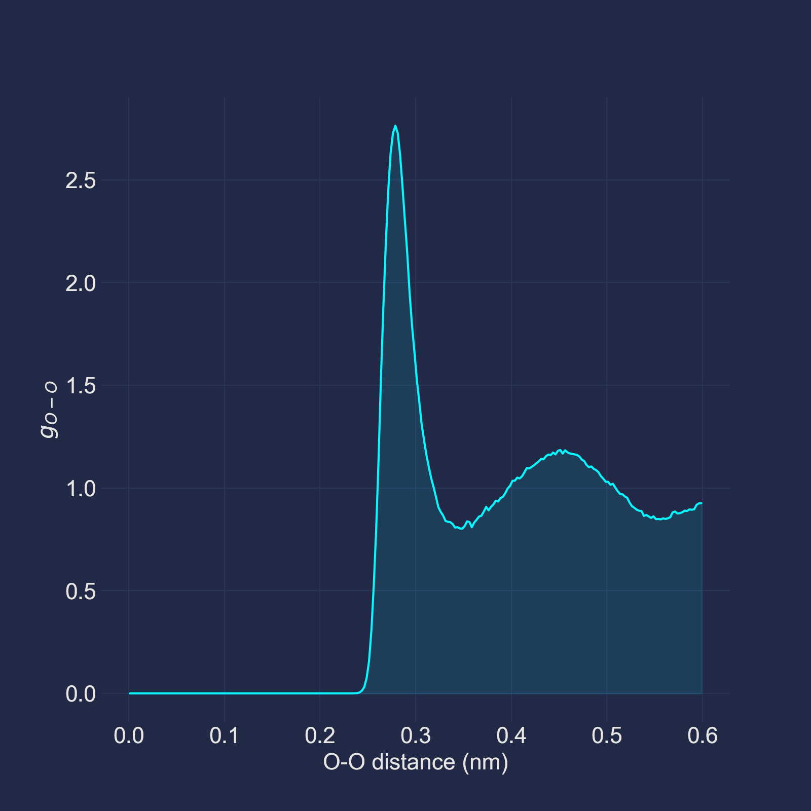
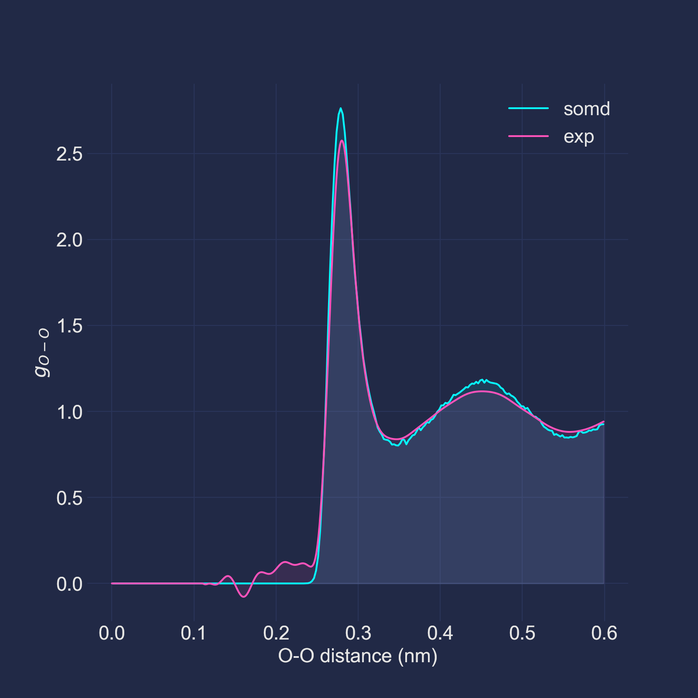

# Simulate the oxygen−oxygen radial distribution function of bulk waters.

Simulating bulk waters' O-O RDF curves is one of the most classical tasks
in the MD community. Thus, I decided to invoke this task as the first SOMD
tutorial. In this tutorial we will run a NVT simulation of a bulk water box.
After getting the simulation trajectory, we will calculate the O-O RDF curve
using the `MDTraj` package. By finishing this tutorial, you may earn some
basic sense about SOMD.

## Pre-requirements

### The pseudopotential files
Download pseudopotential files of oxygen and hydrogen from
[here](https://departments.icmab.es/leem/SIESTA_MATERIAL/Databases/Pseudopotentials/periodictable-gga-abinit.html).
Then copy the two `psf` files to the `data` directory.

## Go through the simulation script.

### Define the simulated system.
```toml
[system]
        structure = "./data/H2O.pdb"
```
We first create the simulated system. SOMD could read atomic information from
two kinds of structure files: the
[POSCAR](https://www.vasp.at/wiki/index.php/POSCAR) and the
[PDB](http://www.wwpdb.org/documentation/file-format-content/format33/v3.3.html)
files. Name of the structure file is defined by the `structure` option in the
`[system]` table. And here we will use a PDB file called `H2O.pdb` located at
the `data` directory.

```toml
[[group]]
        atom_list = "all"
        initial_temperature = 300.0
```
After initializing the simulated system, we assign an atom group to the system.
Atom group is one of the most important concepts in SOMD, many subroutines
in SOMD rely on the specifications of atom groups. In this tutorial, one
atom group is required because:

1. We need to assign initial velocities for atom in the system.
2. The thermostats in SOMD need to know the range of the thermostated atoms
   (you may define more than one atom group in a simulation, if needed).

The group definitions are specifies by the `[[group]]` array of
tables. It is pretty clear that we have assigned all atoms in the system to one
group. And the initial velocities of these atoms will be randomly selected
according to the Boltzmann distribution under 300 Kelvin.

### Set up the potential calculators.
```toml
[[potential]]
        type = "SIESTA"
        siesta_options = """
        xc.functional          GGA
        xc.authors             revPBE

        PAO.BasisSize          DZP
        Mesh.Cutoff            300 Ry
        PAO.EnergyShift        10 meV
        PAO.SoftDefault        T

        SCF.Mixer.Variant      Pulay
        SCF.Mixer.History      8
        DM.NumberPulay         8
        DM.Tolerance           1.d-5
        DM.UseSaveDM           T
        DM.History.Depth       5

        SolutionMethod         diagon
        ElectronicTemperature  1 meV
        # If you do not have ELPA installed, comment out this line:
        Diag.Algorithm         ELPA-1stage
        """
        siesta_command = "mpirun -np 90 /path/to/siesta"
        pseudopotential_dir = "./data"
[[potential]]
        type = "DFTD3"
        functional = "revpbe"
```
Here we first define the parameters of a SIESTA calculation. You should modify
the value of `siesta_command` variable to the actual path of your SIESTA
binary. If you compiled SIESTA with MPI support, the `mpirun` command should
also be included in this string, as shown in the example configuration. And
since we have save the pseudopotential files in the `data` directory, the
`pseudopotential_dir` should also be set properly. Then we define a `DFTD3`
potential to perform the dispersion corrections. Take care of the value the of
the `functional` option (`revpbe` here). It should be the same as the value of
the `xc.authors` key in the SIESTA parameters (`siesta_options`).

### Set up the integrator.
We choose the BAOAB Langevin integrator to propagate our system, and the
integration time step is selected as 0.0005 ps (0.5 fs). The temperature and
relaxation time of the thermostat are selected as 300 K and 0.1 ps,
correspondingly.
```toml
[integrator]
        type = "BAOAB"
        timestep = 0.0005
        temperatures = 300.0
        relaxation_times = 0.1
```

### Set up the trajectory and system data writers.
We will write the simulation trajectory to a HDF5 file (the name of the file
will be automatically determined by SOMD, in particular, `H2O.trajectory.h5`
here), using [MDTraj's convention](https://mdtraj.org/1.9.4/hdf5_format.html).
And we will write the system data (temperatures, pressures, energies, etc.) to
a CSV file (the name of the file will be automatically determined by SOMD as
well, in particular, `H2O.data.csv` here). We require SOMD to update the two
file after each time step by setting the `interval` parameters to 1.
```toml
[[trajectory]]
        format = "H5"
        interval = 1
[[logger]]
        format = "CSV"
        interval = 1
```

### Set up the simulation protocol.
```toml
[run]
        n_steps = 25000
```
The steps to run is defined in the `[run]` table. Here we will run the
simulation for 25000 timesteps.

## Run the simulation.
After the above steps, your working directory should look like this:
```
.
├── data
│   ├── H2O.pdb
│   ├── O.psf
│   └── H.psf
└── H2O.toml
```
Now you could run the simulation by:
```bash
somd -i H2O.toml
```
Or you may want to use a job manager like SLURM. You could simply add the above
command to your submitting script, let's say, `run.sh`:
```bash
#!/bin/bash
#SBATCH -J somd
#SBATCH -o somd.log
#SBATCH -e somd.err
#SBATCH -N 1
#SBATCH -p cpu
#SBATCH --cpus-per-task=96

somd -i H2O.toml
```
and submit the job by:
```bash
sbatch run.sh
```
**Note: the simulation described here is relatively "expensive". On my 96-core
node, this job took about 6 days to finish. You may want to decrease the
simulation steps to lower the computational cost.**

## Analysis the result.
We will use the MDTraj package to compute the O-O RDF curve from the
trajectory. Open a `python` REPL in your working directory and enter the
following lines:

```python
>>> import mdtraj
>>> import numpy as np
>>> from matplotlib import pyplot as plt
>>> traj = mdtraj.load('H2O.trajectory.h5')
>>> traj.top = mdtraj.load('./data/H2O.pdb').top
>>> oxygen_pairs = traj.top.select_pairs('name O', 'name O')
>>> rdf = mdtraj.compute_rdf(traj[5000:], oxygen_pairs, (0, 0.6), n_bins=240)
>>> plt.plot(*rdf)
>>> plt.xlabel("O-O distance (nm)")
>>> plt.ylabel("$g_{O-O}$")
>>> plt.show()
```
The result should look like this:



As can be seen, the resulted RDF curve is similar to the experimental result
reported in *J. Chem. Phys. 138, 074506 (2013)*.


