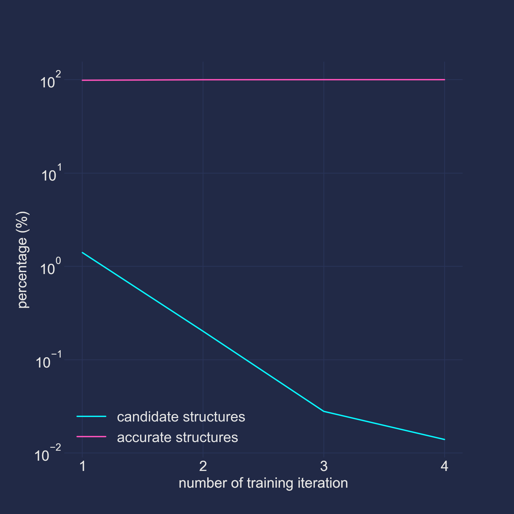
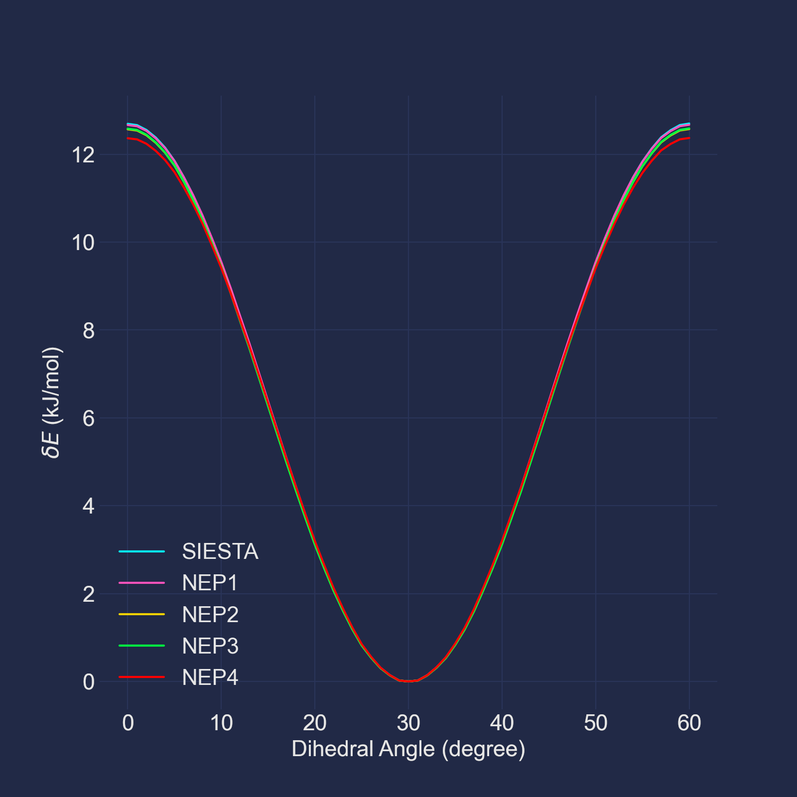

# Fit non-reactive Neuroevolution Potentials (NEPs) of an isolated ethane molecule.

In this tutorial we will try to fit non-reactive Neuroevolution Potentials
(NEPs) of an isolated ethane molecule, by the mean of the active learning
methodology. By finishing this tutorial, you may get familiar with the
active learning module in SOMD. Before starting this tutorial, you are
suggested to read [this article](https://doi.org/10.1016/j.cpc.2020.107206).

## Pre-requirements

### The pseudopotential files
Download pseudopotential files of carbon and hydrogen from
[here](https://departments.icmab.es/leem/SIESTA_MATERIAL/Databases/Pseudopotentials/periodictable-gga-abinit.html).
Then copy the two `psf` files to the `data` directory (or you could use the
provided pseudopotential files).

## Step 1. Generate initial training set.

Before starting the active learning process, an initial training set should be
established. This training set will be invoked to train a set of initial NEPs
during the first iteration of the active learning process. Thus, the
configuration space covered by this initial training set should not be too
narrow. To this end, we will perform an initial simulation under a little
higher temperature (700 K). And the total number of simulation steps will
be 500. For complex systems, you may invoke more complicated protocols to
construct the initial training set. But for our test system, current setup
should be satisfactory.

Since the `nep` package reads the extended XYZ (EXYZ) files as its training
sets and testing sets, you should dump the simulation trajectory in this
format. You should also tell SOMD to record atomic forces in the trajectory
file, since the training of course requires the forces.  Besides, we also
defined the `energy_shift` key here. This key means that when saving potential
energies to the trajectory, SOMD will subtract this value from the energies.
Such a measure is applied because `nep` trains potentials under single
precision, and potential energies with absolute values larger than 100.0 eV
will damage the training accuracy. Thus, we set the value of this key to the
approximate potential energy of our initial conformation (in unit of kJ/mol).

Under the above settings, your input file should look like:
```toml
[system]
        structure = "../data/topo.pdb"
[[group]]
        atom_list = "all"
        initial_temperature = 700.0
[[potential]]
        type = "SIESTA"
        siesta_options = """
        xc.functional          GGA
        xc.authors             revPBE

        PAO.BasisSize          DZP
        Mesh.Cutoff            300 Ry
        PAO.EnergyShift        10 meV
        PAO.SoftDefault        T

        SolutionMethod         diagon
        ElectronicTemperature  1 meV
        # If you do not have ELPA installed, comment out this line:
        Diag.Algorithm         ELPA-1stage
        """
        siesta_command = "mpirun -np 4 /path/to/siesta"
        pseudopotential_dir = "../data"
[[potential]]
        type = "DFTD3"
        functional = "revpbe"
[integrator]
        type = "OBABO"
        timestep = 0.001
        temperatures = 700.0
        relaxation_times = 0.1
[[trajectory]]
        format = "EXYZ"
        write_forces = true
        energy_shift = -40704.6
        interval = 1
[run]
        n_steps = 500
```
Remember to change the value of the `siesta_command` key to the working
SIESTA command.

Now you could enter the `init` directory and run the initial simulation:
```bash
cd init
somd -i init.toml
```
After finishing this task, you will find the trajectory file
(`init.trajectory.xyz`) under the directory. However, most frames in the
output trajectory are still similar, use all these frames as the initial
training set will be a wasting of computational resources. Thus, we could
randomly select 40 frames from the trajectory and use them as the initial
training set. This could be done by invoking the `make_sets.sh` script:
`make_sets.sh`:
```bash
#!/bin/sh

rm -f initial_training_set.xyz
python ../data/split.py \
       -i init.trajectory.xyz \
       --ranges "0:500" \
       --nframes 40 >> initial_training_set.xyz
```
After invoking this script, you will find the `initial_training_set.xyz` files
under the `init` directory. These will be used as the initial training set of
the active learning process.

## Step 2. Perform the training.

After obtaining the initial training set (`init/initial_training_set.xyz`), we
could start the active learning process. Input file of this task could be
simply modified from the previous input file (`init/init.toml`) by adding one
`[active_learning]` table to the file:
```toml
[active_learning]
        n_iterations = 4
        n_potentials = 4
        msd_lower_limit = 25.0
        msd_upper_limit = 250.0
        max_md_steps_per_iter = 50000
        min_new_structures_per_iter = 5
        max_new_structures_per_iter = 20
        initial_training_set = "../init/initial_training_set.xyz"
        nep_options = """
        batch      1000
        generation 100000
        lambda_v   0.0
        """
        nep_command = '/path/to/nep'
        energy_shift = -40704.6
        use_tabulating = true
```
The above settings mean:
- We will perform four iterations of training in total.
- In each training iteration:
  - Four different NEPs will be trained.
  - The number of the MD sampling is 50000.
  - At least 5 and at most 20 new structures will be accepted.
- The force MSD's lower limit of acceptable new structures is 50 kJ/mol/nm
  (about 50 meV/Å), and the force MSD's upper limit of acceptable new
  structures is 250 kJ/mol/nm (about 250 meV/Å).
- The number of NEP training steps is 100000, and the batch size is 1000.
- Weights of the virial are zero, since we are describing an isolated ethane
  molecule.

Note, since we have set the `energy_shift` key when generating the initial
training set, we should set this key in the `[active_learning]` table to the
same value we used there. Also note that you should change the value of the
`nep_command` key to the working `nep` binary. You could also use a job
manager like SLURM to submit the training job, in case your CPU and GPU nodes
are separated. For example (the `--wait` parameter is **REQUIRED**):
```toml
nep_command = "/path/to/sbatch --wait /absolute/path/to/submit_nep.sh"
```
`submit_nep.sh`:
```bash
#!/bin/bash
#SBATCH -J training
#SBATCH -o training.log
#SBATCH -e training.err
#SBATCH -N 1
#SBATCH -p gpu
#SBATCH --cpus-per-task=2
CUDA_VISIBLE_DEVICES=0,1 /path/to/nep
```

However, even the rotation barrier of an ethane molecule is low, 50000 steps
may not be able to generate enough structures in the transition region. Thus,
during the active learning, we could invoke PLUMED to enhance the sampling of
the dihedral angle space of the ethane molecule. To this end, we could append
one PLUMED calculator to the `[[potential]]` array:
```toml
[[potential]]
        type = "PLUMED"
        file_name = "../data/plumed.inp"
```
`plumed.inp`:
```
# vim:ft=plumed
UNITS LENGTH=A TIME=fs
FLUSH STRIDE=1
TORSION ATOMS=3,1,5,7 LABEL=t1
METAD ARG=t1 ...
    PACE=150
    HEIGHT=1.2
    BIASFACTOR=15
    SIGMA=0.25
    FILE=HILLS
    GRID_MIN=-pi
    GRID_MAX=pi
    GRID_BIN=125
    LABEL=m1
...
PRINT FILE=colvar ARG=*
```
And SOMD will automatically exclude the bias potentials brought by PLUMED.

Now you could enter the `train` directory and run the training:
```bash
cd train
somd -i training.toml
```
After finishing this task, you will find the two new items under you working
directory: the `training.active_learning.h5` file and the
`training.active_learning.dir` directory. This `hdf5` file records the training
information, including the training progress, structure numbers, force MSD,
etc. Details about this file could be found
[here](https://github.com/initqp/somd/blob/master/doc/files.md). You could
navigate this file, for example, to view changes of the number of candidate and
accurate structures during the training:
```python
>>> import h5py as h5
>>> import numpy as np
>>> from matplotlib import pyplot as plt
>>> plt.xlabel("number of training iteration")
>>> plt.ylabel("percentage (%)")
>>> plt.yscale("log")
>>> g = h5.File('./training.active_learning.h5')['/iteration_data']
>>> indices = [int(i) for i in g if (g[i].attrs['initialized'] and i != '0')]
>>> n_c = [g[i]['n_candidate_structures'][0] for
           i in g if (g[i].attrs['initialized'] and i != '0')]
>>> n_a = [g[i]['n_accurate_structures'][0] for
           i in g if (g[i].attrs['initialized'] and i != '0')]
>>> plt.plot(indices, np.array(n_c) / 500)
>>> plt.plot(indices, np.array(n_a) / 500)
>>> plt.legend(['candidate structures', 'accurate structures'])
>>> plt.show()
```
And the result would look like:



We could find out that the number of candidate structures is less than 0.02 %
of the number of the MD steps, we may take the training process as converged
(in my case, the number of the accepted new structures in the 4th training
iteration is 7).

The `training.active_learning.dir` directory, on the other hand, contains the
actual training file. For example, you could find the trained NEPs in the
`training.active_learning.dir/iteration_4` directory:
```bash
training.active_learning.dir/iteration_4/potential_0/nep.txt
training.active_learning.dir/iteration_4/potential_1/nep.txt
training.active_learning.dir/iteration_4/potential_2/nep.txt
training.active_learning.dir/iteration_4/potential_3/nep.txt
```

## Step 3. Perform static tests.

We could perform a simple static test of the trained NEPs by rigidly scanning
the dihedral angle potential energy surface of the ethane molecule. Enter the
`test` directory and invoke the following command:
```bash
python test.py
```
Then open a `python` REPL and plot the result with the following commands:
```python
>>> import numpy as np
>>> from matplotlib import pyplot as plt
>>> data_nep = np.loadtxt('./energy_nep.txt')
>>> data_siesta = np.loadtxt('./energy_siesta.txt')
>>> plt.xlabel(r"Dihedral Angle (degree)")
>>> plt.ylabel(r"$\delta E$ (kJ/mol)")
>>> plt.plot(data_siesta[:, 0] * 2,
             data_siesta[:, 1] - data_siesta[:, 1].min(), label='SIESTA')
>>> plt.plot(data_nep[:, 0] * 2,
             data_nep[:, 1] - data_nep[:, 1].min(), label='NEP0')
>>> plt.plot(data_nep[:, 0] * 2,
             data_nep[:, 2] - data_nep[:, 2].min(), label='NEP1')
>>> plt.plot(data_nep[:, 0] * 2,
             data_nep[:, 3] - data_nep[:, 3].min(), label='NEP2')
>>> plt.plot(data_nep[:, 0] * 2,
             data_nep[:, 4] - data_nep[:, 4].min(), label='NEP3')
>>> plt.legend(['SIESTA', 'NEP0', 'NEP1', 'NEP2', 'NEP3'])
>>> plt.show()
```
The result should look like this:


