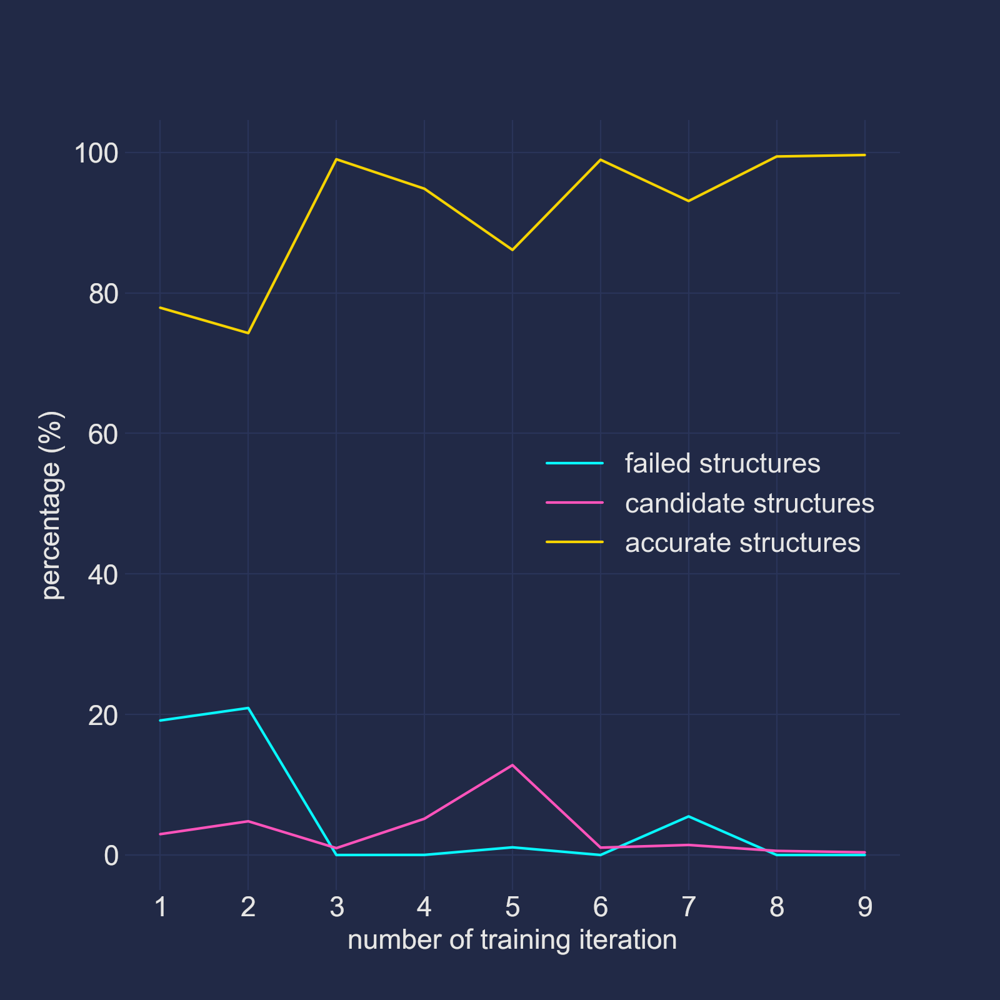
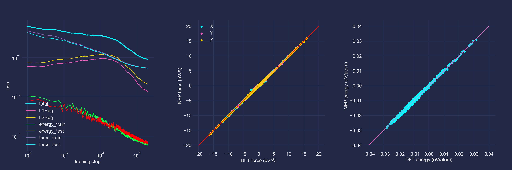

# Fit reactive Neuroevolution Potentials (NEPs) of an elementary reaction within an explicit water box.

In this tutorial we will try to fit reactive Neuroevolution Potentials (NEPs)
for the symmetric $CH_3Cl + Cl^- \rightarrow Cl^- + CH_3Cl$ reaction within an
explicit water box, by the mean of the active learning methodology. By
finishing this tutorial, you may get some sense about how to fit NEPs for
real world systems (especially, aqueous solution systems). Before starting this
tutorial, you are suggested to finish our
[first tutorial](../2.active_learning_1) and read
[this article](https://doi.org/10.1016/j.cpc.2020.107206).

## Pre-requirements

### The pseudopotential files
Download pseudopotential files of hydrogen, carbon, oxygen, sodium and chlorine
from [here](https://departments.icmab.es/leem/SIESTA_MATERIAL/Databases/Pseudopotentials/periodictable-gga-abinit.html).
Then copy the five `psf` files to the `data` directory (or you could use the
provided pseudopotential files).

## Step 1. Set up the simulated system.

Since we are going to simulate the symmetric substitution reaction of a methyl
chloride molecule in explicit solvents, obviously we should set up a water
box around at least a methyl chloride molecule and a chloride anion. However,
simulating charged PBC systems is generally an extremely bad idea, because the
redundant charges are very hard to be screened by the solvents. As a result,
we must add counter ions into our water box. Here I chose to add one sodium ion
to the system (because the cursed pseudopotential file of potassium provided
by the SIESTA team generates ghost states under my setups, although increasing
the core radius seems to get rid of them). And after taking into account the
computational cost, our system was built with 45 water molecules, a methyl
chloride molecule and a sodium chloride ion pair. The density of the system was
set to about 1.0 g/mL, which lead to a cubic simulation box with a side length
of 11.5 Å. The final structure of our system is stored in the `topo.pdb` file
under the `data` directory. This is a snapshot of the system:


## Step 2. Generate initial training set.

Before starting the active learning process, an initial training set should be
established. This training set will be invoked to train a set of initial NEPs
during the first iteration of the active learning process. Thus, conformations
in this initial training set should at least cover the whole reaction path.
But since the energy barrier of this reaction is very high compared with the
thermodynamics energy, the reaction could be very unlikely to happen during
unbiased MD runs. To overcome this difficulty, we could perform a steered MD
simulation under a little higher temperature (350 K). In this steered MD run,
the introduced biasing potential (a
[moving restraint](https://www.plumed.org/doc-v2.8/user-doc/html/_m_o_v_i_n_g_r_e_s_t_r_a_i_n_t.html)
in the language of PLUMED) will act on the well-defined reaction coordinate of
this simple reaction (the distance difference between the two $Cl-C$ bonds),
and drive the system to cross the energy barrier.

Since the `nep` package reads the extended XYZ (EXYZ) files as its training
sets and testing sets, you should dump the simulation trajectory in this
format. You should also tell SOMD to record atomic forces in the trajectory
file. But note that you should avoid also recording the biasing forces in this
trajectory file. This could be done by defining the `potential_list` key in the
`[[trajectory]]` table. Besides, we also defined the `energy_shift` key here.
This key means that when saving potential energies to the trajectory, SOMD will
subtract this value from the energies. Such a measure is applied because `nep`
trains potentials under single precision, and potential energies with absolute
values larger than 100.0 eV will damage the training accuracy. Thus, we set
the value of this key to the approximate potential energy of our initial
conformation (in unit of kJ/mol).

Under the above settings, your input file should look like:
```toml
[system]
        structure = "../data/topo.pdb"
[[group]]
        atom_list = "all"
        initial_temperature = 350.0
[[potential]] # Potential No. 0
        type = "SIESTA"
        siesta_options = """
        xc.functional          GGA
        xc.authors             revPBE

        PAO.BasisSize          TZP
        Mesh.Cutoff            300 Ry
        PAO.EnergyShift        10 meV
        PAO.SoftDefault        T

        SCF.Mixer.Variant      Pulay
        SCF.Mixer.History      8
        DM.NumberPulay         8
        DM.Tolerance           1.d-6
        DM.UseSaveDM           T
        DM.History.Depth       5

        SolutionMethod         diagon
        ElectronicTemperature  1 meV
        # If you do not have ELPA installed, comment out this line:
        Diag.Algorithm         ELPA-1stage
        """
        siesta_command = "mpirun -np 140 /path/to/siesta"
        pseudopotential_dir = "../data"
[[potential]] # Potential No. 1
        type = "DFTD3"
        functional = "revpbe"
[[potential]] # Potential No. 2
        type = "PLUMED"
        file_name = "../data/plumed.1.inp"
[integrator]
        type = "OBABO"
        timestep = 0.001
        temperatures = 350.0
        relaxation_times = 0.1
[[trajectory]]
        format = "EXYZ"
        write_forces = true
        potential_list = [0, 1] # This is the *MOST* important key!
        energy_shift = -2199303.769
        wrap_positions = true
        interval = 1
[run]
        n_steps = 14000
```
`plumed.1.inp`:
```
# vim:ft=plumed
UNITS LENGTH=A TIME=fs
FLUSH STRIDE=1
DISTANCE ATOMS=136,141 LABEL=d1
DISTANCE ATOMS=136,140 LABEL=d2
CUSTOM ARG=d1,d2 FUNC=x-y PERIODIC=NO LABEL=dd
MOVINGRESTRAINT ARG=dd ...
    LABEL=m1
    STEP0=0   AT0=2.0 KAPPA0=250.0
    STEP1=400 AT1=1.8
    STEP2=800 AT2=1.6
    STEP3=1200 AT3=1.4
    STEP4=1600 AT4=1.2
    STEP5=2000 AT5=1.0
    STEP6=2400 AT6=0.8
    STEP7=2800 AT7=0.6
    STEP8=3200 AT8=0.4
    STEP9=3600 AT9=0.2 KAPPA9=300.0
    STEP10=4000 AT10=0.0
    STEP11=4400 AT11=-0.2
    STEP12=4800 AT12=-0.4 KAPPA12=250.0
    STEP13=5200 AT13=-0.6
    STEP14=5600 AT14=-0.8
    STEP15=6000 AT15=-1.0
    STEP16=6400 AT16=-1.2
    STEP17=6800 AT17=-1.4
    STEP18=7200 AT18=-1.4
    STEP19=7600 AT19=-1.6
    STEP20=8000 AT20=-1.8
    STEP21=8400 AT21=-2.0
    STEP22=8800 AT22=-2.2
    STEP23=9200 AT23=-2.4
    STEP24=9600 AT24=-2.4 KAPPA24=0.0
...
LOWER_WALLS ARG=dd KAPPA=200.0 AT=-8.0 LABEL=w1
UPPER_WALLS ARG=dd KAPPA=200.0 AT=8.0 LABEL=w2
PRINT FILE=colvar ARG=*
```

Remember to change the value of the `siesta_command` key to the working
SIESTA command.

Now you could enter the `init` directory and run the initial simulation:
```bash
cd init
somd -i init.toml
```
After finishing this task, you will find the trajectory file
(`init.trajectory.xyz`) under the directory. Apparently this is a large
trajectory with 14000 frames, and using all these conformations to train the
initial NEPs will be a huge waste of computational resources (because many
frames in this trajectory could be very similar, it will be no good to add
all of them to the training set). Thus, we could select some frames from the
trajectory and use them as the training set. But how we could perform the
selection? First we plot the change of the reaction coordinate with respect to
simulation time:


By observing the curve, we may classify the whole trajectory into four stages:
- 0 to 3000 fs: the pre-transition state (pre-TS) region;
- 3000 to 5000 fs: the TS region;
- 5000 to 10000 fs: the post-TS region;
- 10000 to 14000 fs: the post-TS region without any biasing potential.

Bearing this information in mind, we could randomly select 50 frames from each
and use them as the initial training set. This could be done by invoking the
`make_sets.sh` script:

`make_sets.sh`:
```bash
#!/bin/sh

rm -f initial_training_set.xyz
python ../data/split.py \
       -i init.trajectory.xyz \
       --ranges "0:3500,3500:4500,4500:10000,10000:14000" \
       --nframes 50 \
       --perrange >> initial_training_set.xyz
```
After invoking this script, you will find the `initial_training_set.xyz` files
under the `init` directory. These will be used as the initial training set of
the active learning process.

## Step 3. Perform the training step 1.

Here we run four iterations of active learning with the same setups as above
(including the biasing potentials). Input file of this task could be simply
modified from the previous input file (`init/init.toml`) by adding one
`[active_learning]` table to it:
```toml
[active_learning]
        n_iterations = 4
        n_potentials = 4
        msd_lower_limit = 200.0
        msd_upper_limit = 400.0
        max_md_runs_per_iter = 5
        max_md_steps_per_iter = 8000
        min_new_structures_per_iter = 20
        max_new_structures_per_iter = 100
        initial_training_set = "../init/initial_training_set.xyz"
        nep_options = """
        n_max      4 4
        cutoff     8 6
        neuron     10
        lambda_v   0.0
        batch      1000
        generation 50000
        """
        nep_command = "/path/to/nep"
        energy_shift = -2199303.769
```
The above settings mean:
- We will perform four iterations of training in total.
- In each training iteration:
  - Four different NEPs will be trained.
  - Five MD runs will be performed to collective conformations.
  - The length of the MD runs is 8000.
  - At least 20 and at most 250 new structures will be accepted.
- The force MSD's lower limit of acceptable new structures is 200 kJ/mol/nm
  (about 2 eV/Å), and the force MSD's upper limit of acceptable new
  structures is 400 kJ/mol/nm (about 4 eV/Å). You may have found that these
  boundary values are much higher the ones we used in the first tutorial. As
  suggested in [this article](https://doi.org/10.1016/j.cattod.2021.03.018),
  these values are optimal for aqueous solution systems.
- The number of NEP training steps is 50000, and the batch size is 1000.
- Weights of the virial are zero.
Note, since we have set the `energy_shift` key when generating the initial
training set, we should set this key in the `[active_learning]` table to the
same value we used there.

Note that you should change the value of the `nep_command` key to the working
`nep` binary. You could also use a job manager like SLURM to submit the
training job, in case your CPU and GPU nodes are separated. For example
(the `--wait` parameter is **REQUIRED**):
```toml
nep_command = "/path/to/sbatch --wait /absolute/path/to/submit_nep.sh"
```
`submit_nep.sh`:
```bash
#!/bin/bash
#SBATCH -J training
#SBATCH -o training.log
#SBATCH -e training.err
#SBATCH -N 1
#SBATCH -p gpu
#SBATCH --cpus-per-task=2
CUDA_VISIBLE_DEVICES=0,1 /path/to/nep
```
Now you could enter the `training_step_1` directory and run the training:
```bash
cd training_step_1
somd -i training.toml
```
After finishing this task, you will find the trained NEPs in the
`training_iter_4` directory:
```bash
training_iter_4/potential_0/nep.txt
training_iter_4/potential_1/nep.txt
training_iter_4/potential_2/nep.txt
training_iter_4/potential_3/nep.txt
```
And you can find the `training_info.json` files under each `training_iter_i`
(where `i` is the number of the training iteration) directory. This file
records some important information of the training iteration, e.g., the number
of the accepted new structures (the `n_accepted_structures` key). However, at
this point, the training seems to be far from converge because there are still
too many (about 5% of the total visited structures) candidate structures:
```json
"n_visited_structures": 40000,
"n_accurate_structures": 37988,
"n_candidate_structures": 1973,
"n_accepted_structures": 100,
"n_failed_structures": 39,
```
What's more, during this training step, the simulations are all driven by the
strong moving restraints. As a result, the visited conformation space will be
liminal. Thus, we need to perform more active learning iterations to obtain
robust NEPs.

## Step 4. Perform the training step 2.

During this step, we will change the type of the biasing potentials and perform
another four iterations of active learning. To this end, we first change the
invoked PLUMED file to `plumed.2.inp`:
```toml
[[potential]]
        type = "PLUMED"
        file_name = "../data/plumed.2.inp"
```
`plumed.2.inp`:
```
# vim:ft=plumed
UNITS LENGTH=A TIME=fs
FLUSH STRIDE=200
DISTANCE ATOMS=136,141 LABEL=d1
DISTANCE ATOMS=136,140 LABEL=d2
CUSTOM ARG=d1,d2 FUNC=x-y PERIODIC=NO LABEL=dd
LOWER_WALLS ARG=dd KAPPA=200.0 AT=-5.0 LABEL=w1
UPPER_WALLS ARG=dd KAPPA=200.0 AT=5.0 LABEL=w2
METAD ARG=dd ...
    PACE=10
    HEIGHT=1.0
    BIASFACTOR=40
    SIGMA=0.1
    FILE=HILLS
    GRID_MIN=-8
    GRID_MAX=8
    GRID_BIN=800
    CALC_RCT
    LABEL=m1
...
PRINT FILE=colvar STRIDE=50 ARG=*
```
Here we defined a metadynamics simulation, which is more "gentle" than the
steered MD. Then, we increase the MD simulation time to 250000 steps and reduce
the number of MD runs to 1 to sample a broader conformation space:
```toml
[active_learning]
        n_iterations = 4
        n_potentials = 4
        msd_lower_limit = 200.0
        msd_upper_limit = 400.0
        max_md_runs_per_iter = 1
        max_md_steps_per_iter = 250000
        min_new_structures_per_iter = 20
        max_new_structures_per_iter = 100
        initial_training_set = "../training_step_1/training_iter_4/train.xyz"
        initial_potential_files = [
                "../training_step_1/training_iter_4/potential_0/nep.txt",
                "../training_step_1/training_iter_4/potential_1/nep.txt",
                "../training_step_1/training_iter_4/potential_2/nep.txt",
                "../training_step_1/training_iter_4/potential_3/nep.txt",
        ]
        nep_options = """
        n_max      4 4
        cutoff     8 6
        neuron     10
        lambda_v   0.0
        batch      1000
        generation 60000
        """
        nep_command = "/path/to/nep"
        energy_shift = -2199303.769
```
Note, since we are "restarting" the training based on the previous trained
potentials in `training_step_1`, we should properly define the
`initial_potential_files` key, which contains path of the initial NEPs.
Besides, the `initial_training_set` should be modified as well, since the
training set has been cumulated.

After modifying the value of the `nep_command` key, you could enter the
`training_step_2` directory and run the training:
```bash
cd training_step_2
somd -i training.toml
```
After finishing this task, you will find the trained NEPs in the
`training_iter_4` directory as usual. Here we plot the number of failed,
candidate and accurate structures with respect to the total training iteration
number:



From the above figure, we can find out that at the first training step, the
NEPs failed to describe nearly most all structures. And when the training set
size raised to about 300, number of the failed structures was largely declined.
Thus, it seems that our initial training set may be a little small, and
increasing its size to about 300 may be a more optimal choice.

## Step 5. Perform the final training.
We have already obtained a much more robust training set with 1000 structures
(the `training_step_2/training_iter_4/train.xyz` file) from the step 4. Now we
could use this final training set to train a better converged NEP. The `nep.in`
file in the `final_training` directory was prepared for this task:
```
type 5 C Cl H Na O

n_max      8 8
cutoff     8 6
neuron     40
lambda_v   0.0
batch      1000
generation 200000
```
Here we will use a larger NN size and run for more training steps to increase
the training convergence. To perform the finial training, you should invoke the
`copy_set.sh` script first to copy the training and testing sets. Then you
could submit a regular NEP training task under this directory by invoking `nep`
directly. For example:
```bash
cd final_training
CUDA_VISIBLE_DEVICES=0,1 /path/to/nep
```
After the training, the final NEP (the `nep.txt` file) will appear under the
directory (or you may want to take a look at the NEP trained by me under the
`results` directory). We could also check some training data to ensure the
convergence (namely, the `loss.out`, `force_train.out` and `energy_train.out`
files):



## Perform the production run.
Finally, we could use the trained NEP to perform production tasks. Here we will
try to calculate the free energy barrier of the reaction using PLUMED and
GPUMD. To this end, we will run a 15 ns long metadynamics simulation under
300 K, and this is the `run.in` file:
```
potential     ../final_training/nep.txt

velocity      300
ensemble      nvt_bao 300 300 100
plumed        ../data/plumed.3.inp 1 0
time_step     0.5
dump_thermo   10000
dump_position 10000
run           30000000
```
To lower the errors introduced by the biasing potentials, we will decrease
the deployment frequency of the Gaussian potentials. Thus, another PLUMED file
(`plumed.3.inp`) will be used here:

`plumed.3.inp`:
```
# vim:ft=plumed
UNITS LENGTH=A TIME=fs
FLUSH STRIDE=5000
DISTANCE ATOMS=136,141 LABEL=d1
DISTANCE ATOMS=136,140 LABEL=d2
CUSTOM ARG=d1,d2 FUNC=x-y PERIODIC=NO LABEL=dd
LOWER_WALLS ARG=dd KAPPA=250.0 AT=-5.0 LABEL=w1
UPPER_WALLS ARG=dd KAPPA=250.0 AT=5.0 LABEL=w2
METAD ARG=dd ...
    PACE=250
    HEIGHT=1.0
    BIASFACTOR=50
    SIGMA=0.15
    FILE=HILLS
    GRID_MIN=-8
    GRID_MAX=8
    GRID_BIN=800
    CALC_RCT
    LABEL=m1
...
PRINT FILE=colvar STRIDE=250 ARG=*
```
You could now enter the `production` directory and submit a regular GPUMD
task. For example:
```bash
cd production
CUDA_VISIBLE_DEVICES=0,1 /path/to/gpumd
```
(Note, you should compile your GPUMD binary with the `-DUSE_PLUMED` option on.)
After the calculation, invoke the `barrier.sh` script to get the barrier height
value. Using the NEP trained by me, I got a barrier of about 100.2 kJ/mol:
```bash
./barrier.sh
# BARRIER HEIGHT: 100.195868 +- 7.540640 (kJ/mol)
```
Since the experimental value is about 111 kJ/mol, we could say the result is
acceptable. The errors come from the following aspects:
- The simulation box is small. Larger boxes should give better results.
- We were using the pure functional, and hybrid functionals could largely
  improve the accuracy.
- The pseudopotentials of SIESTA are not optimal.

## Acknowledgment
Thanks to [Dr. Fan](https://github.com/brucefan1983) for much meaningful
guidance.
